# Schéma de la base de données

État au 10 octobre 2026 (après la suppression du lien entre journaux et événements). La source de vérité reste `apps/api/prisma/schema.prisma` : ce document est à
mettre à jour quand le schéma change.

La base est une MariaDB de 12 tables. Tout part de `users` : supprimer un utilisateur supprime en cascade
tout ce qui lui appartient.

## Vue d'ensemble

```mermaid
erDiagram
    users ||--o{ user_roles : "a pour rôles"
    users ||--o{ user_identities : "se connecte via"
    users ||--o{ refresh_tokens : "a des sessions"
    users ||--o{ email_verification_tokens : "confirme son email"
    users ||--o| archer_profiles : "a un profil"
    users ||--o{ profile_invitations : "invite"
    users ||--o{ favorite_sites : "garde"
    users ||--o{ journals : "tient"
    users ||--o{ goals : "se fixe"
    users ||--o{ journal_sessions : "possède"
    journal_sessions ||--o{ session_photos : "illustré par"
    users ||--o{ session_photos : "possède"

    users {
        char36 id PK
        varchar email UK
        varchar password_hash "nul si Google ou Apple seul"
        datetime email_verified_at
        varchar display_name
        varchar locale "fr ou en"
    }
    user_roles {
        char36 user_id PK,FK
        enum role PK "ADMIN, ARCHER, COACH"
    }
    user_identities {
        char36 id PK
        char36 user_id FK
        enum provider "GOOGLE, APPLE"
        varchar subject "identifiant chez le fournisseur"
        varchar email
    }
    refresh_tokens {
        char36 id PK
        char36 user_id FK
        char36 family_id "chaîne de rotation"
        char64 token_hash UK
        varchar device_name
        datetime expires_at
        datetime revoked_at
        char36 replaced_by_id
    }
    email_verification_tokens {
        char36 id PK
        char36 user_id FK
        char64 token_hash UK
        datetime expires_at
        datetime used_at
    }
    archer_profiles {
        char36 user_id PK,FK
        varchar licence_number
        enum category "U11 à S3"
        enum bow_type "6 types d'arc"
        json disciplines "liste de disciplines"
    }
    profile_invitations {
        char36 id PK
        char36 user_id FK
        varchar name
        varchar email "unique par archer"
        boolean is_coach
        char64 token_hash UK
        datetime accepted_at "nul = en attente"
    }
    favorite_sites {
        char36 id PK
        char36 user_id FK
        varchar label
        varchar url
    }
    journals {
        char36 id PK
        char36 user_id FK
        varchar title
        date start_date
        date end_date
        json month_themes "décor et coloriage par mois"
    }
    journal_sessions {
        char36 id PK
        char36 user_id FK
        enum type "5 types d'événement"
        date date
        varchar start_time "HH:mm, nul = journée"
        smallint duration_minutes
        varchar location
        enum discipline "7 disciplines"
        smallint distance_meters
        smallint arrow_count
        smallint score
        text objective
        tinyint satisfaction "0 à 10"
        tinyint technique "0 à 10"
        text description
        enum physical_feeling
        enum mental_feeling
        json went_well "3 lignes au plus"
        json to_improve "3 lignes au plus"
        text next_time
        varchar title "événement Divers"
        varchar color "événement Divers"
        varchar icon "événement Divers"
    }
    goals {
        char36 id PK
        char36 user_id FK
        enum type "SPORT, TECHNIQUE, PHYSICAL, PERSONAL"
        varchar description
        date created_on "jour où l'objectif est fixé"
        date achieved_on "nul = pas encore atteint"
    }
    session_photos {
        char36 id PK
        char36 session_id FK
        char36 user_id FK
        smallint width
        smallint height
        int size_bytes
    }
```

Les colonnes `created_at` et `updated_at`, présentes sur presque toutes les tables, sont omises du schéma.

## Les tables par domaine

### Comptes et connexion

| Table                       | Rôle                                                                                                    |
| --------------------------- | ------------------------------------------------------------------------------------------------------- |
| `users`                     | Le compte : email, mot de passe haché (absent pour un compte Google / Apple seul), nom affiché, langue. |
| `user_roles`                | Les rôles d'un compte, cumulables : `ADMIN`, `ARCHER`, `COACH`.                                         |
| `user_identities`           | Les comptes externes liés (Google, Apple).                                                              |
| `refresh_tokens`            | Une ligne par jeton de session émis ; la rotation permet de détecter un jeton volé.                     |
| `email_verification_tokens` | Les liens de confirmation d'adresse email.                                                              |

### Profil de l'archer

| Table                 | Rôle                                                                                                            |
| --------------------- | --------------------------------------------------------------------------------------------------------------- |
| `archer_profiles`     | Les informations sportives : licence, catégorie, arme, disciplines pratiquées. Créée au premier enregistrement. |
| `profile_invitations` | Les personnes invitées par email ; `accepted_at` passe de nul à une date quand l'invité accepte.                |
| `favorite_sites`      | Les sites web préférés.                                                                                         |

### Journal

| Table              | Rôle                                                                                                                                                                                                                                                                         |
| ------------------ | ---------------------------------------------------------------------------------------------------------------------------------------------------------------------------------------------------------------------------------------------------------------------------- |
| `journals`         | Un journal par saison : titre, date de début et de fin. C'est une période, sans lien avec les événements. `month_themes` contient, mois par mois, le décor choisi et son coloriage.                                                                                          |
| `journal_sessions` | Les événements de l'archer, tous types confondus. Ils n'appartiennent à aucun journal : ils s'affichent dans celui dont la période couvre leur date. Les champs de la fiche de séance sont facultatifs ; `title`, `color` et `icon` ne servent qu'aux événements « Divers ». |
| `session_photos`   | La fiche de chaque photo (dimensions, poids). Les fichiers eux-mêmes sont dans le stockage S3, pas dans la base.                                                                                                                                                             |

### Objectifs

| Table   | Rôle                                                                                                                                             |
| ------- | ------------------------------------------------------------------------------------------------------------------------------------------------ |
| `goals` | Les objectifs que l'archer se fixe : type, description, jour de création et jour où il est atteint. Ils ne dépendent d'aucun journal ni période. |

## Points à connaître

- **Identifiants** : toutes les clés sont des UUID stockés en `CHAR(36)`.
- **Journal et événements** : il n'y a pas de clé étrangère entre `journals` et `journal_sessions`. Les
  événements d'un journal sont ceux de l'archer dont la `date` est comprise entre `start_date` et `end_date`.
  Deux journaux d'un même archer ne doivent pas se chevaucher : c'est l'API qui le vérifie, pas la base.
- **Suppressions en cascade** : supprimer un utilisateur supprime tout ce qui lui appartient, et supprimer un
  événement supprime les fiches de ses photos (leurs fichiers sont effacés par l'API, pas par la base).
  Supprimer un journal ne supprime que lui : ses événements restent.
- **Dates du journal** : `date`, `start_date` et `end_date` sont des jours sans fuseau horaire, et
  `start_time` un texte `HH:mm` — 18 h reste 18 h sur tous les appareils.
- **Colonnes JSON** : `month_themes`, `disciplines`, `went_well` et `to_improve` contiennent de petites
  listes ou structures que l'API valide ; la base ne contrôle pas leur forme.
- **`user_id` sur `session_photos`** : il est redondant avec l'événement, mais permet à l'API de vérifier
  le propriétaire en une seule requête.
- **Jetons** : la base ne stocke jamais un jeton en clair, seulement son empreinte (`token_hash`).
- **Listes de valeurs** (`enum`) : rôles, fournisseurs de connexion, types d'événement, disciplines,
  ressentis, catégories d'âge et types d'arc sont définis dans `schema.prisma`.
